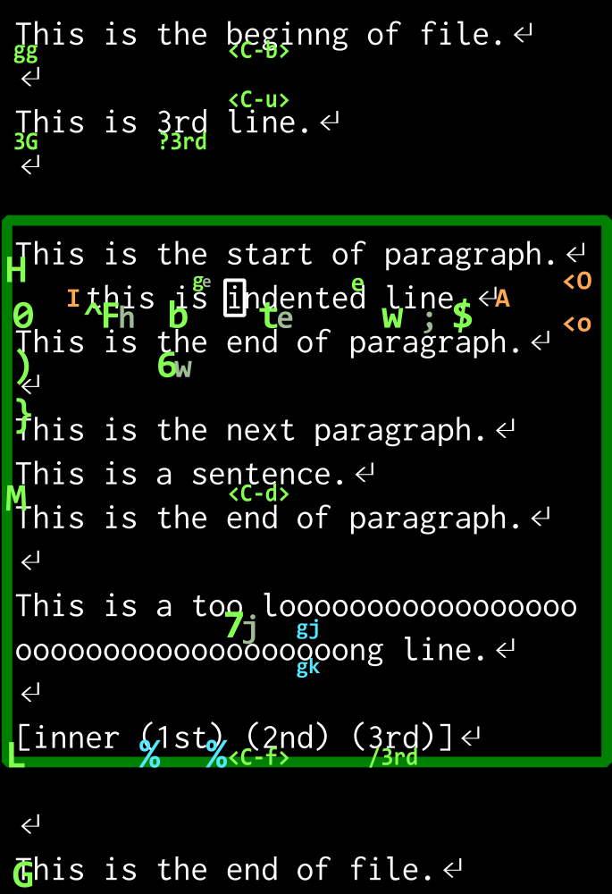

% Vim 初心者のための Vim 講座
% KMC1回生 wass80
% 2015/11/6

## 自己紹介

+ 工学部情報学科 1回生
+ Js と Ruby が母言語に近い
+ Haskell が好き
+ Vim 2年目程度

-----

## この講座の対象

+ Vim を使ってみたい人
+ Vim をメモ帳レベルにしか使っていない人

-----

## この講座の対象外の人

+ vimrc の設定したい
+ 良さのあるプラグインを教えてほしい
+ 別のエディタをバリバリ使っている

. . .

> 宗教戦争をしに来たわけではない

-----

## 目標

+ 移動速度を上げる
+ オペレータを活用する
+ テキストオブジェクトを使えるようになる
+ 繰り返しがサクッとできるようになる

→ あなた, まだキーボードを連打していませんか?

このスライドの半分以上は移動するコマンドの紹介です

でも言いたいことは後半

-----

### 先に

いろいろ言いますが, (僕は)覚えられないです

お手元に Vim を用意しておくのが一番良さそうです

-----

### Vim のインストール

お手元に *nix の端末があるなら, たいてい入っている

Windows では Kaoriya 版 Vim がいろいろ入っていて使いやすい

[http://www.kaoriya.net/software/vim/](http://www.kaoriya.net/software/vim/)

gvim : gui 版 vim

-----

## Vim の モード

Vim にはモードが有る

+ Normal モード : 起動時のモード
+ Insert モード [i] : テキストを入力するモード
+ Visual モード [v] : テキストを選択するモード
+ Command Line モード [:] : Exコマンドを打つモード

Normal モードから[]のキーを押すことで, Normal以外のモードに推移

Esc を押すことで Normal モードに戻る

-----

## 基本コマンド

+ `` i `` Insert モードに
+ `` v `` Visual モードに
    + 上のモードで `` <Esc> `` Normal モードに
+ `` u `` 元に戻す [Undo]
+ `` :w<CR> `` 書き込み [write]
+ `` :q<CR> `` 閉じる [quit]

. . .

+ `` <CR> `` は Enterキー [Carriage Return]
+ `` <C-x> `` は CTRL キーと x を同時押しの意味
+ `` <M-x> `` META(ALT)キーも存在する

-----

## 移動コマンド

+ `` h `` N文字右に
+ `` j `` 論理行でN行下に
+ `` k `` 論理行でN行上に
+ `` l `` N文字左に

-----

### Nって?

Vim の大体のコマンドは前に数字をつけることが出来る

+ `` 123j `` 123行下に(いけるところまで)

指定しない場合大抵 N=1

基本的にN回繰り返すことと同等

-----

### Vimの移動方法は多い

------

### もっと大きく動く

+ `` $ `` `` ^ `` (`` 0 ``) 行末に 空白を除く行頭に (実の行頭に)
+ `` G `` `` gg `` 最後の行に 最初の行(N行目)に
+ `` ( `` `` ) `` 次文に, 前文に
+ `` { `` `` } `` 次段落に, 前段落に
+ `` <C-d> `` `` <C-u> `` 半画面に下に 上に [Down,Up]
+ `` <C-f> `` `` <C-b> `` 一画面に下に 上に [Foward,Back]
+ `` H `` (`` M ``) (`` L ``) 画面上部に (中央に) (下部に) [High,Middle,Low]

-----

### マウスより早い移動

+ `` w `` `` b ``  (`` W `` `` B ``) 1単語右に 左に (WORD単語で) [Word,Back]
+ `` e `` (`` ge ``) 単語の終わりに (前の単語の終わりに) [End]
+ `` % `` 対応するカッコに移動する (次の閉じカッコに移動)

WORD は空白区切りの文字列  
単語は hoge-piyo の - とかで区切られる

+ `` fx `` `` tx `` (`` Fx `` `` Tx ``) 次のxに 次のxの手前に (前の) [Find,To]

`` f `` と `` t `` は `` ; `` で繰り返せる

-----

### 画面外にも移動

+ `` /hoge `` (`` ?hoge ``) hogeを下に検索する (上に)
+ `` n `` (`` N ``) 次の検索文字列へ (前の) [Next]
+ `` gd `` (`` gD ``) 関数内でカーソル下の単語の定義元に (ファイル内)
+ `` [m `` (`` ]m ``) 次のメソッドに (前)
+ `` [/ `` (`` ]/ ``) 次のコメントに (前)
+ `` g; `` 前変更箇所に移動, もっと前にも戻れる → :changes
+ `` <C-o> `` (``  <C-i> ``) 大きな移動の前に戻る (進む) → :jumps

-----

### 入力と同時に

移動後に Insert モードになる

| 移動のみ | Insertモードに |
|----------|----------------|
| なし     | `` i ``        |
| `` l `` 一文字右  | `` a `` [Append]  |
| `` ^ `` 先頭 | `` I ``        |
| `` $ `` 終わり | `` A ``        |
| `` g; `` 前変更 | `` gi ``       |

`` 10i=<Esc> `` ========== を入力してくれる

`` o `` (`` O ``) 新しい次の行(前の行)を作り Insertモードに

-----

## オペレータコマンド

テキストを操作する

+ `` d `` (`` dd ``) 削除 (一行削除) [Delete]
+ `` y `` (`` Y ``) ヤンク (一行ヤンク) ヤンクはコピーと同じ意味 [Yank]
+ `` c `` (`` cc ``) 変更 (一行変更) [Change]
+ `` gu `` (`` gU ``) 小文字化 (大文字化)
+ `` > `` (`` < ``) インデント (逆インデント)

変更は削除してから Insert モードに入る

削除, ヤンクしたものは `` p `` で貼り付けられる [Paste]

----------

## Visual モードでテキストを選択して使うことが出来る

範囲選択後にオペレータ

* `` v5wd `` 5単語選択して削除

-------

### 移動と組み合わせる

オペレータは移動を続けることでも働く

* `` dw `` 単語末まで削除 [Delete Word]
* `` c{ `` 段落末まで置換

`` v5wd `` より `` d5w `` が楽

これが大量の移動コマンドがある理由!

> "delete 5 words" と感じ取れれば良い

`` 5dw `` と `` d5w `` は同じ

> "5times delete a word" と "delete 5 words" の違い程度

-----

### 行指向

上下に動くものは行全てに適用される

* `` dj `` 下2行を削除
* `` dvj `` 行指向でなくす
* `` d<C-v>j `` ブロック指向

Visualモードに入るコマンドと対応している

-----

### 変更は繰り返せる

直前の変更を `` . `` で繰り返すことが出来る

* `` dw.... `` 5単語削除
* `` ihoge<CR><Esc>.. `` hoge を 3回挿入

---------

## テキストオブジェクト

移動の代わりに使える, 範囲を表すモノ

(hoge) にたいして

* `` a( `` は (hoge) [Around]
* `` i( `` は hoge [Inner]

例えば `` ci[ `` は [] 内を変更 [Change Inner []]

------------

| オブジェクト                       | 意味          | 例                       |
| --------------                     | ------------- | ------------------------ |
| `` w `` (`` W ``)                  | 単語 (WORD)   | hoge (HO=GE)             |
| `` s `` (`` p`` )                  | 文 (段落)     | hoge.                    |
| `` [ `` `` ( `` `` { `` `` < `` | カッコ        | (hoge)                   |
| `` t ``                            | htmlタグ      | &lt;p&gt;hoge&lt;p&gt;   |
| `` " `` `` ' `` `` \` ``           | クオート類    | "hoge"                   |

`` das `` 一文削除 [Delete A Sentence]

`` a ``は周りの空白ごと削除する

-----

### textobjプラグイン

* (hoge + piyo, piyo) → (piyo, hoge + piyo)
    * textobj-argument と operator-exchange
* apple orange suica → apple apple apple
    * operator-replace
* /* comment */ → comment
    * textobj-comment と operator-comment
* "word" → 'word'
    * vim-surround
* textobj-entire, line, indent, function も便利

一覧 : [http://d.hatena.ne.jp/osyo-manga/20130717/1374069987](http://d.hatena.ne.jp/osyo-manga/20130717/1374069987)

-----

## 覚えられないよ!

便利なコマンドは使うようになるので,   
何度か実践してみよう

vimtutor は良く出来ているし :help を読もう

矢印キーを使わないで, 移動を活用してみる

------

## まとめ
+ Normalモードにある大量の移動コマンドを覚えよう
+ オペレータと組み合わせると最強になれる
+ テキストオブジェクトは便利

## その次へ

まだまだ便利なコマンドはたくさんある

+ Exモードのコマンド類(:subsutitute , :! , :global , :help) 
+ バッファ, ウインドウ, タブの関係
+ レジスタ, マーク, 折りたたみ, マクロ
+ Vimgrep, quickfix
+ Insertモードでのコマンド
+ 基本的な vimrc 設定

--------

便利なプラグインもたくさんある

+ NeoBundle プラグイン管理
+ Unite 一覧, 検索
+ NeoComplete 補完
+ Quickrun
+ textobj類
+ airline ステータスラインをリッチに
+ fugitive git
+ Emmet html編集
+ etc...

-----

# 答えられる限りの質問に答える

neovim 1.0出ました
